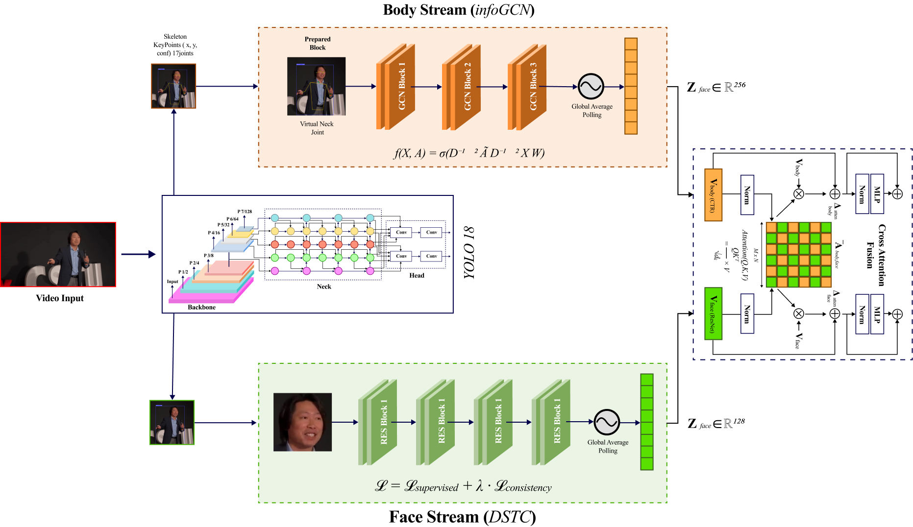

# GRACE: Graph-Residual Affective Computing Engine


GRACE is a non-verbal, video-based approach to stress and confidence
assessment in academic settings. This repository contains the
individual model components released alongside the GRACE paper: a
skeleton-based affective stream built on an InfoGCN-style graph
convolutional backbone, and a facial-expression affective stream built
on a Deformable-Transformer-based DSCT model with a ResNet-50 backbone.

[Read the paper](PAPER_LINK_PLACEHOLDER)

## Architecture overview



**Skeleton stream (`grace/models/skeleton/infogcn.py`)** — consumes
normalized joint-coordinate sequences `(N, C, T, V)` extracted from a
presenter's body keypoints, and produces affect-category logits via a
stack of graph-convolution + temporal-convolution blocks with a
gain/shift bottleneck before the final classifier.

**Facial stream (`grace/models/facial/dsct.py`)** — consumes raw video
frames, localizes and classifies the presenter's facial expression
using a pretrained DSCT checkpoint, and returns per-class probabilities
together with the matched face bounding box.

**Shared pre-processing (`grace/models/preprocessing/yolo18_pose.py`)**
— a YOLO-Pose wrapper that augments the standard 17-keypoint COCO
output with an interpolated 18th (neck/SSN) keypoint, used by both the
skeleton stream's input pipeline and the facial stream's bounding-box
matching.

## Repository structure

```
GRACE/
├── README.md
├── LICENSE
├── requirements.txt
├── .gitignore
├── configs/
│   ├── skeleton_config.yaml
│   └── facial_config.yaml
├── grace/
│   ├── __init__.py
│   ├── models/
│   │   ├── __init__.py
│   │   ├── skeleton/
│   │   │   └── infogcn.py
│   │   ├── facial/
│   │   │   └── dsct.py
│   │   └── preprocessing/
│   │       └── yolo18_pose.py
│   ├── data/
│   │   └── dataset.py
│   └── utils/
│       ├── box_ops.py
│       ├── metrics.py
│       └── logger.py
├── scripts/
│   ├── train_skeleton.py
│   ├── train_facial.py
│   └── evaluate.py
├── third_party/
│   └── DSCT/            # place your local DSCT codebase here
├── checkpoints/
├── assets/
│   └── figures/
└── docs/
    └── citation.md
```

## Installation

```bash
git clone https://github.com/ERRAFI-IMRANE/GRACE.git
cd GRACE
pip install -r requirements.txt
```

The facial stream additionally requires a local copy of the external
DSCT codebase — see `third_party/DSCT/README.md` for setup
instructions.

## Dataset

Both streams are trained and evaluated on the **Body Language Dataset
(BoLD)**, a large-scale naturalistic video benchmark annotated across
26 affect categories.

## Dataset

Both streams are trained and evaluated on the **Body Language Dataset
(BoLD)**, a large-scale naturalistic video benchmark annotated across
26 affect categories.

The dataset is mirrored as a password-protected archive. To request
access, email **i.errafi32@uca.ac.ma** with the subject line
`GRACE dataset access request` — you'll receive the download link and
extraction password by reply.

## Pretrained weights

Pretrained checkpoints for both streams are distributed as a
password-protected archive. To request access, email
**i.errafi32@uca.ac.ma** with the subject line
`GRACE weights access request` — you'll receive the download link and
extraction password by reply.

Place downloaded checkpoint files under `checkpoints/`.

## Usage

### Skeleton stream

```python
from grace.models.skeleton.infogcn import InfoGCNSkeletonStream

model = InfoGCNSkeletonStream(
    num_joints=18,
    num_classes=26,
    pairs=[...],       # skeleton edge list, see configs/skeleton_config.yaml
    in_channels=2,
)
logits = model(x)      # x: (N, C, T, V) joint-coordinate tensor
```

Training:
```bash
python scripts/train_skeleton.py --config configs/skeleton_config.yaml
```

### Facial stream

```python
from grace.models.facial.dsct import DSCTFacialStream

stream = DSCTFacialStream(
    dsct_repo_path="third_party/DSCT",
    ckpt_path="checkpoints/facial/checkpoint-caer-s.pth",
    yolo_path="checkpoints/preprocessing/yolo18.pt",
)
probas, box = stream.predict(frame)   # frame: a single BGR video frame
```

This repository includes inference code only for the facial stream —
training/fine-tuning DSCT itself is done via its own external codebase
(see `scripts/train_facial.py` for pointers).

### Evaluation

```bash
python scripts/evaluate.py --stream skeleton --config configs/skeleton_config.yaml --checkpoint checkpoints/skeleton/epoch_100.pt
python scripts/evaluate.py --stream facial   --config configs/facial_config.yaml
```

## Citation

```bibtex
@article{AUTHOR_PLACEHOLDER_YEAR_PLACEHOLDER,
  title   = {TITLE_PLACEHOLDER},
  author  = {AUTHOR_PLACEHOLDER},
  year    = {YEAR_PLACEHOLDER},
  journal = {JOURNAL_PLACEHOLDER},
  url     = {PAPER_LINK_PLACEHOLDER}
}
```

See `docs/citation.md` for the full entry.

## License

Released under the [MIT License](LICENSE).
